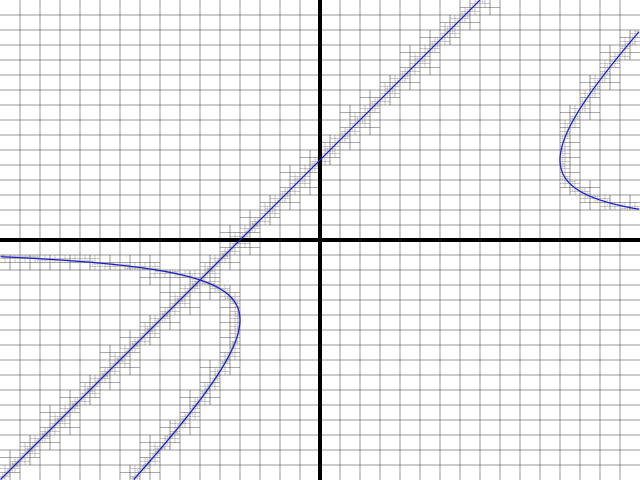

# Isosurfaces

Constructs isolines of a given two-dimensional scalar field, i.e. curves over which `f(x,y)=0` for a given real-valued function `f(x,y)`.

An example graph, including quad lines, of `y(x-y)^2 = 4x+8` (Python expression: `y*(x-y)**2 - 4*x - 8`)

This is designed to be extensible (soon™) to three- and four- dimensional scalar fields.

Currently building this as a ground-up rewrite of [my past attempt](https://github.com/jared-hughes/iso_simplicial).

Other terms for an isoline:

- Contour
- Level curve
- Topographic map

Related projects:

- (2D, grid-based) https://pypi.org/project/meander/
- (2D, grid-based) https://pypi.org/project/contours/
- (Archived) https://github.com/AaronWatters/contourist
